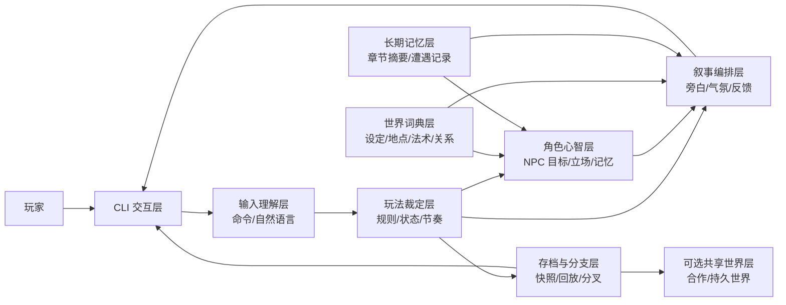
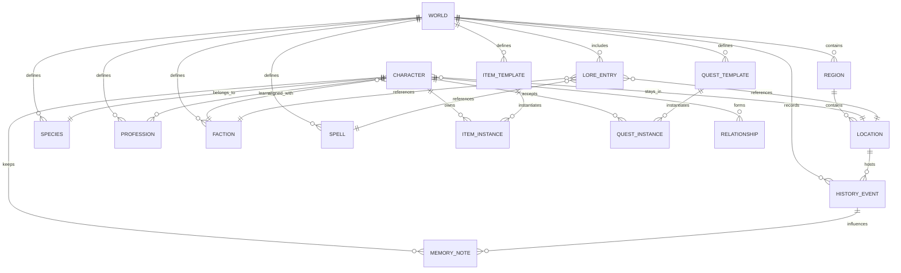
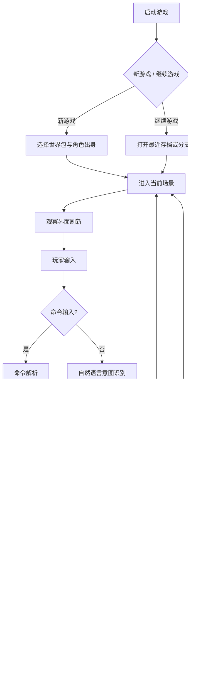

# 基于AI驱动的CLI互动式小说游戏产品设计文档

## 执行摘要

本文面向产品经理、交互设计、内容策划与业务决策者，目标是设计一款**中文优先、CLI 优先、AI 驱动、支持大世界观扩展**的互动式小说游戏。若用户未指定约束，本文统一采用以下假设：**无特定地区合规限制、无既有 IP 授权限制、无必须离线运行要求、首发以单人体验为主、多人/持久世界为可选增强、首发平台为桌面终端环境**。本文刻意**不展开代码、部署、数据库或运维细节**，只讨论产品层设计、能力边界与可落地的体验方案。

核心设计结论是：这类产品不应被定义为“会编故事的聊天机器人”，而应被定义为“**以 AI 负责表达、塑造与反应，以产品规则负责真值、节奏与可玩性的交互叙事系统**”。RAG 的经典研究表明，把模型参数记忆与外部检索结合，能提升知识密集任务中的事实性与可更新性；Generative Agents 研究则说明，可信 NPC 更依赖“观察—记忆—反思—计划”的结构，而不是单轮即兴生成。与此同时，主流平台已经把 file search、知识检索、上下文缓存、工具调用、多模态输入做成标准产品能力，这意味着本项目在产品上采用“世界资料库 + AI 角色分工 + 存档分支”的路线是成熟的。citeturn21search0turn16search0turn20search7turn3search7turn11search1

另一个决定性判断是：**超长上下文不是世界观管理方案，只是昂贵的缓冲带**。当前主流模型虽然普遍提供 200K、400K 乃至 1M 级上下文，但长上下文通常伴随更高成本、更强的 Beta/分层限制，或对提示与缓存策略提出更严格要求。因此，产品设计上不应依赖“把整个世界观文档塞进提示词”，而应采用“设定词典 + 检索块 + 长期摘要 + 用户可见存档”的内容组织方式。citeturn0search1turn0search3turn7search4turn10search0turn18search0

就商业化与体验平衡而言，最推荐的产品目标不是一步到位做“开放式永久在线大型文字网游”，而是优先打磨一个**高一致性、强沉浸、可分支存档、可长期游玩**的单人产品：它支持自然语言与命令双轨输入，支持 ASCII/Unicode 地图、任务日志、关系图谱、设定百科，支持 AI NPC 的长记忆与立场变化，并允许用户像管理代码分支一样管理剧情分叉。多人合作与持久世界可作为后续版本的产品扩展，而不应成为 MVP 的前置条件。

## 产品定位与用户场景

从产品形态看，CLI 并不是这类游戏的妥协版界面，反而适合承载“文字密度高、状态复杂、键盘优先、可回放、可导出”的体验。已有官方终端 AI 产品，如 entity["company","阿里云","cloud platform"] 的 Kilo CLI 与 Qwen Code，都表明终端交互已经是大模型产品的正式交付界面之一，而不是实验性附件。这对互动式小说游戏尤其有利：CLI 让玩家更容易看到世界状态、命令历史、分支存档、日志重放与百科检索，也天然适合远程、低图形依赖和高可追踪性的使用场景。citeturn2search0turn2search1

这款产品的目标用户不只是“喜欢文字游戏的人”，而是四类更清晰的人群。第一类是**叙事型单人玩家**，他们要的是沉浸、长线代入、角色成长与自由表达。第二类是**TRPG 与世界观爱好者**，他们希望得到接近“没有真人 GM 时也能持续推进”的体验。第三类是**设定党与写作者**，他们更在意世界规则、人物关系网、事件年表与可版本化的剧情草案。第四类是**键盘优先与工具型用户**，他们习惯在终端里工作，希望一切都能通过命令、快捷键、日志与导出完成。上述用户画像并非互斥，实际上会在同一用户身上叠加，因此产品必须同时满足“低门槛进入”和“高深度停留”两种诉求。

围绕这些用户，最重要的使用场景有五个。其一，是**二十到六十分钟的日常冒险会话**：快速进入一个场景，调查、对话、战斗或旅行，然后保存退出。其二，是**长线角色扮演**：玩家在同一角色上持续数十小时推进，要求世界记得他做过什么。其三，是**设定探索**：玩家或内容创作者需要随时查询种族、法术、地点、派系和历史。其四，是**剧情分支试玩**：玩家在关键节点创建分叉存档，测试不同决定的后果。其五，是**协作观战或合作战役**：这不是首发主线，但应在产品概念上预留。  

在产品价值主张上，建议把本产品表述为：**“一个可长期经营的文字冒险世界，而不是一次性的 AI 聊天故事。”** 这一定义会直接影响需求取舍：如果是“聊天故事”，系统只需要会写；如果是“世界”，系统就必须会记、会查、会解释“为什么现在会变成这样”。

### 目标用户与优先场景

| 用户群 | 他们真正想买到的价值 | 优先满足的产品能力 |
|---|---|---|
| 单人冒险玩家 | 高沉浸、长线代入、自由行动 | 即时旁白、任务推进、战斗/探索循环、快速存档 |
| TRPG / 世界观重度用户 | 大世界观、一致性、NPC 不失忆 | 设定百科、关系系统、长期记忆、历史事件可追溯 |
| 写作者 / 设定党 | 可编辑的世界骨架与剧情枝条 | 世界包、任务模板、时间线、关系网、分支导出 |
| 键盘优先用户 | 低摩擦、高透明、高可控 | 命令集、快捷键、ASCII 地图、日志、回放、比较 |

### 产品成功标准

产品层建议用以下成功标准定义首版成败。第一，**新用户在 10 分钟内能完成“看—走—谈—接任务—存档”**。第二，**老用户在 20 回合后仍感到 NPC 与世界记得自己**。第三，**关键世界事实可被 `百科/日志/关系` 三种界面交叉验证**。第四，**自然语言输入不会挤压命令式用户的效率**。第五，**分支存档是用户可见、可理解、可回退的，而不是后台黑箱**。这些标准比单纯的“回复是否漂亮”更接近产品真实价值。

## 核心玩法与世界观策略

核心玩法不应被设计成“玩家说一句、AI 接一句”的松散对话，而应是一个稳定循环：**感知场景 → 表达意图 → 系统裁定 → AI 叙事呈现 → 世界状态更新 → 进入下一回合**。其中 AI 可以高度参与“如何说、说成什么风格、NPC 怎么回应”，但不应独占“事情有没有发生、资源有没有消耗、关系是否改变”的判断权。Generative Agents 研究对“观察—记忆—反思—计划”的角色行为结构提供了参考，而 RAG 研究说明，外部知识层对一致性非常关键。citeturn16search0turn21search0

与传统纯文字冒险不同，这款产品应至少支持三种回合粒度并存。**场景回合**用于观察、对话、调查、交易、潜行与轻度互动；**冲突回合**用于战斗、追逐、谈判僵局与倒计时事件；**旅程回合**用于跨区域移动、露营、补给、时间推进与遭遇战。这样做的产品意义在于：玩家不会因为所有行为都太细而疲劳，也不会因为所有行为都被一句“你成功了/失败了”带过而失去参与感。

### 世界观与内容策略

建议将世界观拆成四层内容资产，而不是做成一大团 lore 文本。

第一层是**核心设定层**，包括种族、职业、派系、地点、历史、法术、物品、任务类型和基本政治／宗教／经济规则。这一层必须具有较高稳定性，是世界的“宪法”。第二层是**地区风味层**，包括区域习俗、口音、材料、天气、方言、敌对关系、城市惯例等，是世界的“地方性差异”。第三层是**动态剧情层**，包括任务链、事件年表、NPC 秘密、关系变化和玩家影响，是世界的“正在发生”。第四层是**运营扩展层**，包括节庆事件、限时战役、创作者包、社区精选内容，是世界的“可持续更新能力”。

建议将内容包设计成四类产品对象：**世界包**、**规则包**、**剧情包**、**活动包**。世界包定义地理与历史；规则包定义资源体系、职业与法术规则风格；剧情包定义任务、角色和地点事件；活动包定义节庆、限时分支或共创主题。这样做的好处是，产品更新时不必每次都重写整个宇宙，而可以按内容层独立扩展。  

### 世界元素清单与可扩展策略

| 维度 | 首版必须具备 | 后续可扩展 |
|---|---|---|
| 种族 | 生理特征、社会标签、起始偏好 | 亚种、文化流派、地区差异 |
| 职业 | 核心资源、成长路线、标志能力 | 转职、混职、派系限定职业 |
| 地点 | 层级地图、地区标签、危险度、控制势力 | 天气、地形交互、城市法令 |
| 历史 | 关键事件、年代、影响范围 | 多版本史观、失真叙事、传说与真相分离 |
| 物品 | 装备、消耗品、任务物、材料 | 套装、传家物、唯一物品传承 |
| 任务 | 主线、支线、委托、调查、护送 | 连锁后果、多解法、失败分支 |
| 关系 | 好感、敌意、义务、债务、阵营立场 | 谣言、公开声望与私下印象分离 |
| 法术 | 消耗、施法条件、效果风格 | 学派、禁术、施法事故、副作用 |

一个非常关键的产品原则是：**真相与认知必须分离**。例如，“某位将军当年背叛了王国”是世界事实；“酒馆老板相信将军是被冤枉的”是 NPC 认知；“玩家听说将军可能另有隐情”是玩家可见知识。只有把这三层分开，世界才会显得真实，NPC 才不会全知全能，剧情才有调查与误导空间。

另一个关键原则是：**世界观扩展应尽量新增，不轻易推翻**。产品上建议为设定项引入“正史级别”标签，例如：铁定正史、地区通说、学者争议、街头流言。这样做有两个好处：一是它天然允许世界逐步扩张而非频繁重置；二是它让 AI 在叙事时可以“有意保留不确定性”，减少硬性自相矛盾。

### 系统概念图

下面的概念图不是技术架构图，而是给产品团队讨论“玩家、世界、AI 与存档”之间关系的产品示意图。



从产品讨论视角看，上图表达的是：**玩家面对的不是一个“回答问题的模型”，而是一个由玩法、叙事、NPC 心智、世界词典和可回放存档共同组成的交互系统**。这也是为什么首版必须优先做“世界结构”和“状态可见性”，而不是把全部预算压在单一大模型上。

### 数据模型 ER

下面的 ER 图同样是用于产品讨论的概念模型，不是数据库设计图。它帮助团队统一理解“这个世界到底由哪些对象组成”。



## AI 角色与内容生成方案

从产品方案看，entity["company","OpenAI","ai company"]、entity["company","Anthropic","ai company"]、entity["company","Google Cloud","cloud platform"]、阿里云与entity["company","DeepSeek","ai company"]等主流平台，已经分别把长上下文、缓存、工具、知识检索、多模态和思考模式做成产品能力，但它们在价格、交互风格、区域约束、是否擅长在线低延迟与是否适合后台深思考方面差异很大。对本产品而言，最优解不是押注单一模型，而是把 AI 划成若干**产品角色**：在线叙事者、NPC 扮演者、剧情规划者、任务生成者、摘要器、检索规划器与安全过滤器。citeturn0search1turn7search8turn8search3turn19search3turn14search3

### AI 角色设计

建议把 AI 能力拆成以下六类产品角色：

| AI 角色 | 面向用户看到的结果 | 产品职责 | 是否必须实时 |
|---|---|---|---|
| 叙事编排器 | 旁白、气氛、结果描述、建议下一步 | 把已发生的事情说得好看且清楚 | 是 |
| NPC 扮演器 | NPC 台词、态度、情绪、行动倾向 | 让角色像“有过去的人”而非随机答话机 | 是 |
| 检索规划器 | 不直接对用户可见 | 决定本回合该调用哪些世界资料与记忆 | 是 |
| 长期摘要器 | 章节摘要、任务回顾、日志提炼 | 压缩长会话，减轻上下文膨胀 | 否 |
| 任务/剧情规划器 | 新支线、后续事件、章节建议 | 为内容团队与动态世界提供中层骨架 | 否 |
| 安全与边界过滤器 | 拒绝、脱敏、风险提示 | 拦截越权信息、恶意注入和不当输出 | 是 |

这套分工背后的产品理由很明确。OpenAI 官方提示工程文档强调：不同模型类型在速度、成本与推理方式上权衡不同；Anthropic 的提示工程文档强调先定义成功标准与评测，再谈 prompt 优化；Gemini 3 的官方文档则明确指出，Gemini 3 是推理模型，提示应更简洁直接，而非延续旧式冗长 prompt 技巧。对产品团队而言，这意味着**一个回合内调用多个不同角色模型，是正常设计，而不是工程妥协**。citeturn11search0turn5search2turn8search3

### 长期记忆与 RAG 的产品方案

长期记忆不应等同于“把所有历史对话继续拼进上下文”。更好的产品方案是把记忆分成四层。第一层是**世界事实层**：地点、人物、派系、任务阶段、关键历史。第二层是**会话状态层**：当前场景、当前战斗、最近若干回合。第三层是**情节记忆层**：某个 NPC 记得玩家救过自己、坑过自己、欠过自己钱。第四层是**语义摘要层**：章节摘要、人物画像、长期关系走向。RAG 的研究说明，参数记忆与外部检索结合，比单靠模型内部记忆更适合知识密集和长期一致性的任务；Generative Agents 研究则证明，记忆、反思与计划的分层会显著提升角色可信度。citeturn21search0turn16search0

在产品实现思路上，RAG 应主要服务四类信息：**世界词典、历史事件、任务日志、NPC 长期记忆**。如果从供应商工具视角看，OpenAI 的 File Search 明确支持语义与关键词检索；阿里云百炼也提供知识检索工具，通过知识库 ID 把检索内容接入模型。它们共同支持一种产品判断：**世界观要以“可查证的外部知识层”存在，而不是作为一段永远被塞进系统提示里的大文本**。citeturn20search7turn3search7

### 模型高层对比

下表以**产品决策视角**比较模型。这里的“延迟”是相对判断，不是 SLA；其意义是帮助 PM 判断哪些更适合“玩家每回合都等”的在线链路，哪些更适合“后台慢慢想”的离线链路。

| 模型 | 官方价格口径 | 延迟判断 | 高层能力判断 | 最适合扮演的产品角色 | 来源 |
|---|---|---|---|---|---|
| GPT-5.4 mini | 输入 $0.75 / 百万 token，缓存输入 $0.075，输出 $4.50；400K 上下文；支持文本/图像输入、工具、搜索、文件搜索、函数调用 | 较低 | 速度与能力平衡，适合高频调用 | 在线叙事、命令解释、轻量 NPC、检索编排 | citeturn0search1turn0search2turn11search1 |
| Claude Sonnet 4 | 输入 $3 / 百万 token，输出 $15；200K 标准上下文，1M 上下文为 Beta 且长上下文有更高计费 | 中 | 文本质量强、长对话稳、适合高价值节点 | 关键剧情节点、复杂角色对白、长摘要 | citeturn7search8turn7search5turn7search4turn5search7 |
| Gemini 3 Flash Preview | 输入 $0.5 / 百万 token，输出 $3；支持 thinking level、函数调用、结构化输出、URL context、代码执行、上下文缓存、多模态 | 较低 | 多模态与低延迟兼顾，适合实时交互 | 多模态输入、实时叙事、地图/图片解释 | citeturn10search0turn8search0turn8search3 |
| Qwen3.6-Plus | 中国内地 0–256K 输入 2 元 / 百万 token，输出 12 元；支持文本、图像、视频输入；官方定位为“效果、速度、成本均衡”，最大上下文 1,000,000 | 较低 | 中国部署友好，多模态与长上下文能力强 | 中文主市场首选在线模型、视觉扩展 | citeturn18search1turn19search3turn3search0turn3search6turn3search7 |
| Qwen3-Max | 最低输入 2.5 元 / 百万 token，输出 10 元；最大上下文 262,144；官方定位“复杂任务，能力最强”；部分快照支持思考与内置工具 | 中 | 更适合复杂任务与高价值离线生成 | 剧情规划、世界扩写、复杂任务设计 | citeturn19search1turn19search4turn19search3 |
| DeepSeek-chat / deepseek-reasoner | chat 低价位明显；reasoner 价格更高但仍低于多数闭源强模型；DeepSeek 对思考模式、`reasoning_content` 与多轮拼接有单独约束，高流量时可能出现较长等待 | 中且高峰波动更明显 | 极致性价比，但产品上要更谨慎规划思考链路 | 离线剧情规划、廉价总结器、实验代理 | citeturn14search5turn14search7turn14search3turn14search4 |

综合来看，首版最合理的产品路线是**双层或三层模型策略**：  
其一，在线主链路选“低延迟平衡型模型”；  
其二，高价值节点选“高质量写作/推理模型”；  
其三，分类、改写、槽位抽取与摘要选“廉价子模型”。  

这也与官方文档给出的方向一致：OpenAI 将 mini/nano 明确定位为高吞吐与子代理；Gemini 3 Flash 强调在延迟、效率与成本上的优势；阿里云将 Qwen3.6-Plus 定位为效果、速度、成本均衡；DeepSeek 则把思考模式与非思考模式明显区分。citeturn0search2turn8search0turn19search3turn14search2

### 提示工程原则与模板

提示工程不应只由算法团队掌握，而应成为产品团队、内容团队和 QA 团队共享的资产。OpenAI 强调要 pin 模型快照并建立 eval；Anthropic 强调先定义成功标准再调 prompt；Gemini 3 强调提示要简洁直接；DeepSeek 给出了按任务区分温度的明确建议；Qwen3.6 文档则指出，在某些非 Agent 对话场景中不必机械依赖 system message，而应以更清晰的任务输入组织要求。citeturn11search0turn11search3turn5search2turn8search3turn14search0turn3search1

因此，产品侧建议建立四类模板资产：**叙事模板、NPC 模板、检索模板、任务模板**。以下模板以“可交给内容团队直接改写”为目标。

#### 叙事编排模板

```text
角色：你是“旁白编排器”，只能描述已经被系统裁定发生的结果。
目标：
- 生成 80~180 字中文叙事
- 突出环境、因果和可执行下一步
- 不新增世界真相，不改写任务状态

输入：
- 当前地点：
- 玩家动作：
- 系统裁定结果：
- 可引用世界信息：
- 当前语气风格（冷峻/史诗/轻松/惊悚）：

输出：
- 旁白：
- 玩家可见新信息：
- 建议下一步（最多 3 个）：
```

**示例用例**：玩家在黑松镇北门用“伪装成商队护卫”的方法潜入。系统已裁定“守卫产生迟疑，但未完全相信”。叙事模板负责把这种“半成功”描述得既可读又可继续行动。

#### NPC 扮演模板

```text
角色：你只扮演一个 NPC。
约束：
- 只根据该 NPC 已知信息回答
- 允许误解，不允许全知
- 台词要体现身份、利益和当前情绪

输入：
- NPC 身份：
- NPC 目标：
- NPC 与玩家关系：
- NPC 已知记忆摘要：
- 当前场景：
- 玩家刚刚说/做了什么：

输出：
- 台词：
- 情绪标签：
- 是否记住这件事：
- 关系变化建议：
```

**示例用例**：负伤信使在紧张、失血与不信任状态下接受玩家询问。模型不该像百科全书一样给出整段主线答案，而应只给出此人当下能表达的信息。

#### 检索规划模板

```text
角色：你是检索规划器。
目标：决定本回合为了保证世界一致性，需要查什么。

输入：
- 玩家当前目标：
- 当前地点：
- 涉及人物：
- 活跃任务：
- 最近回合摘要：

输出：
- 必查设定：
- 必查人物记忆：
- 必查任务阶段：
- 可选补充资料：
- 不需要检索的内容：
```

**示例用例**：玩家试图向守卫谎称自己认识镇长。系统应优先检索“镇长是谁、守卫是否认识镇长、玩家与镇长是否有交集、该城门的通行习惯”，而不是把一大堆无关 lore 塞进模型。

#### 任务生成模板

```text
角色：你是任务设计助理。
目标：生成一条适配当前世界规则与地区风格的支线任务。

输入：
- 地区：
- 地区主题：
- 可用 NPC：
- 玩家当前等级段：
- 当前主线阶段：
- 禁止事项（不要重复主线、不要破坏地区正史）：

输出：
- 任务名：
- 起因：
- 三个可行动目标：
- 一个意外反转：
- 两种结局：
- 对世界状态的最小影响：
```

**示例用例**：在“黑松镇雨季、城门戒严、巡林队失踪”的主线背景下，自动生成一个与盗匪、走私、误导信息有关的支线，而不是凭空出现太空陨石或现代枪械。

### 成本、延迟、隐私与安全

产品层面的成本优化，核心不是“每个回合少 50 个 token”，而是**谁在线、谁离线；什么内容固定缓存、什么内容按需检索；什么人物需要精演、什么人物走轻量模式**。OpenAI 明确说明 Prompt Caching 可降低成本与延迟，并要求把静态前缀放在前、动态变量放在后；Anthropic 也把 prompt caching 做成显式定价能力；Gemini 3 和 Qwen3 系列都把长上下文、缓存、思考级别作为重要产品参数。对本项目的直接含义是：**世界规则、输出格式、角色骨架与固定叙事风格应尽量静态化；玩家输入、当前场景与检索命中应尽量动态化**。citeturn11search1turn5search0turn8search0turn18search1

隐私与安全方面，不可把“提示注入”理解成纯工程风险，它也会直接破坏剧情体验与世界一致性。entity["organization","OWASP","security nonprofit"] 将提示注入、敏感信息泄露、过度代理、系统提示泄漏和向量/嵌入弱点列为 LLM 应用核心风险；entity["organization","NIST","us standards body"] 的 Generative AI Profile 则强调把风险控制嵌入整个 AI 生命周期。对产品层的落点是：用户输入、知识库片段、社区内容、Mod 文本都必须被视为**不可信输入**；高权限工具必须有可见审批；敏感信息与系统词条必须有分级可见性；日志导出与共享前必须支持脱敏。citeturn17search0turn17search2turn17search1

供应商隐私政策差异同样会影响产品路线。OpenAI 官方说明 API 默认不使用客户输入训练模型，并默认保留最长 30 天的 abuse monitoring logs，同时提供按项目配置的数据驻留；Anthropic 在其商业产品说明中表示对商业客户数据按处理者角色处理，并不使用这些数据训练生成模型；Google Cloud 则说明在 Vertex AI 上，如无客户事先许可或指令，不会使用客户数据训练或微调 AI/ML 模型，并对区域端点、全球端点与数据驻留做了区分。换句话说，产品若面向 B 端或高校/机构客户，必须把“供应商选择、区域选择、是否开启联网、是否允许日志留存”做成可配置策略，而不是写死。citeturn12search8turn20search0turn13search0turn22search2turn12search1turn12search2

## CLI 体验与存档协作

CLI 的首要设计目标不是“酷”，而是**让玩家在纯键盘环境里始终知道自己在哪、能做什么、刚刚发生了什么、接下来还有哪些路径**。因此，本产品不建议只暴露一个输入框，而应采用“**场景区 + 状态区 + 建议动作区 + 输入区**”的板式布局。这样既有小说阅读感，也保留系统透明度。

### CLI 交互原则

建议同时支持两条输入路径。第一条是**显式命令通道**，用于高频动作与可预测操作；第二条是**自然语言行为通道**，用于复杂、含糊或创造性意图。前者满足老玩家效率，后者满足新玩家表达自由。这并不冲突，反而是文本 RPG 的最佳组合。  

命令集建议分为六组：观察、移动、社交、冲突、认知、系统。一个足够好的命令集不需要覆盖所有可能行为，而是应成为“**系统最稳定、最常用、最可预期的捷径**”。

### 建议命令集

| 类别 | 命令示例 | 产品意图 |
|---|---|---|
| 观察 | `:look` `:inspect` `:scan` | 快速理解环境与对象 |
| 移动 | `:go north` `:travel 黑松镇` `:camp` | 明确位置变更与时间推进 |
| 社交 | `:talk 旅商米娅` `:ask 守卫韩德` | 明确发起对话对象 |
| 冲突 | `:attack` `:cast 火花术` `:guard` | 将高风险动作结构化 |
| 认知 | `:map` `:codex` `:journal` `:relations` | 查看世界、任务与关系 |
| 系统 | `:save` `:branch` `:compare` `:replay` | 管理版本与回顾剧情 |

自然语言输入建议走“先意图再修辞”的产品路径。也就是说，玩家说“我想装成巡逻兵，先压低帽檐，再趁雨势混过去”，系统不应直接原样扔给叙事模型，而应先识别出“伪装、潜入、利用天气掩护”的意图，再让 AI 去生成内容。这会同时提升准确性、可调试性与叙事质量。

### 多模态、地图、快捷键与无障碍

多模态应是**可选增强**，不是首版前提。当前官方模型普遍支持图像或更广泛的多模态输入：GPT-5.4 mini 支持文本与图像及工具；Gemini 3 Flash 支持文本、代码、图像、音频、视频和 PDF；Qwen3.6-Plus 原生支持视觉理解。对产品的含义是：MVP 可坚持文本优先，但应预留“看一张地图截图、识别一张符咒、听一段口供”的入口，不要把交互模型锁死在纯文本。citeturn0search1turn8search0turn3search0

地图建议采用 ASCII/Unicode 双模式。ASCII 负责兼容性与远程环境，Unicode 负责更强表现力。快捷键建议至少支持 `Tab` 补全、`↑/↓` 历史命令、`Ctrl-R` 搜索历史、`?` 快速帮助、`Alt-1..9` 快捷动作、`Ctrl-L` 清屏重绘。无障碍模式至少应包括：高对比、去颜色、简化地图、屏幕阅读器友好描述、输入辅助与行动建议冗余提示。后者非常重要，因为 CLI 中大量信息若只靠颜色表达，体验会立刻崩掉。

### CLI 界面流程图



### 关键 ASCII 原型

#### 主场景界面

```text
┌─ Chronicle CLI ─────────── Day 14 / 雨夜 / 危险: 中 ─────────────┐
│ 地点: 黑松镇·北门                                                │
├─────────────────────────────────────────────────────────────────┤
│ 你站在城门箭塔下，雨水沿石砖流进排水沟。两名守卫正在盯着林线。    │
│ 地上有一张被雨打湿的赏金告示，远处传来短促的狼嚎。                │
│                                                                 │
│ NPC: [1] 守卫韩德   [2] 旅商米娅   [3] 负伤信使                    │
│ 出口: 南→集市   东→城墙步道   西→马厩                            │
│ 线索: 告示*  泥印  断裂箭杆                                       │
├─────────────────────────────────────────────────────────────────┤
│ HP 34/40   MP 12/18   声望[城镇:+8][盗匪:-12]                    │
│ 当前任务: 追查失踪巡林队                                         │
├─────────────────────────────────────────────────────────────────┤
│ 可选: :look   :talk 3   :read 告示   :map                        │
│ 自然语言: 我先检查信使的伤势，再问他从哪条林道逃出来。            │
└─> 
```

#### 地图界面

```text
                         北
                ┌────────山道────────┐
                │                    │
         马厩──集市─────@北门─────城墙步道
                │   \                │
                │    酒馆──神殿──墓园 │
                └────────南门──────河桥

图例: @你   ?未探索   !事件   ✦任务   ~危险区域
```

#### 对话界面

```text
┌─ 对话: 负伤信使 ────────────────────────────────────────────────┐
│ 状态: 紧张 / 失血 / 戒备                                         │
│ 关系: 中立偏不信任                                               │
├─────────────────────────────────────────────────────────────────┤
│ 信使：……别靠太近。你不是巡逻队的人。                            │
│                                                                 │
│ 你可以：                                                         │
│ 1. :ask 信使 "谁袭击了你？"                                      │
│ 2. :use 绷带 on 信使                                             │
│ 3. :act "亮出城镇徽记，说明来意"                                 │
│ 4. :threaten                                                     │
├─────────────────────────────────────────────────────────────────┤
│ 提示：治疗可降低敌意；威胁可能提高信息量，但伤害长期关系。         │
└─> 
```

#### 存档与分支界面

```text
[存档树]

main ──● 入城夜雨
        ├─● 接下告示
        ├─● 北门盘问
        └─◉ 当前

branch/伪装潜入 ──● 雨夜混关
                  └─● 守卫起疑

branch/先救信使 ──● 伤口包扎
                  └─● 获得林道情报

命令:
:save "北门前夜"
:branch 伪装潜入
:compare main..branch/先救信使
:replay 最近5回合
```

### 存档、版本控制与用户可见 UX

存档系统在这类产品里不是功能页，而是**核心体验的一部分**。建议首版就提供三种存档动作：**快速保存、命名保存、分支保存**。快速保存满足“我先下线”；命名保存满足“我想记住这一刻”；分支保存满足“我想试试另一条命运线”。

推荐的用户可见流程是：
1. 任何关键剧情节点后自动给出“保存/分支”轻提示；  
2. 玩家可在 `:save` 时加一句自然语言备注，例如“我准备威胁守卫前”；  
3. `:branch` 会把当前状态复制成平行线，并在 UI 中可视化；  
4. `:compare` 不是技术 diff，而是给玩家看“任务、关系、地点、资源、已知信息”的差异摘要；  
5. `:replay` 则以简洁日志回看最近回合，让玩家记起“我到底是怎么走到这里的”。

这套 UX 的价值是把“AI 游戏的不确定性”转化成“玩家可掌控的探索乐趣”。如果没有版本分支，玩家会把 AI 看作不稳定；一旦支持分支与回溯，玩家就会把它理解为“命运树”。

### 多人、合作与持久世界

多人/合作建议作为可选产品功能，而不是首版核心。产品上可分三个层级。最轻的是**共享旁观模式**：一人游玩，其他人观看并投票建议。中间层是**房间式合作战役**：多名玩家共处同一场景，各自有输入权，系统轮流裁定。最重的是**持久世界**：玩家不同时在线也会影响世界状态，城镇价格、地区声望、势力冲突会持续演化。

产品优先级上，建议先做共享旁观或双人合作，再评估持久世界。因为持久世界虽然听起来宏大，但它会把内容生产、平衡、治理、外挂、防剧透与活动运营难度整体抬升一个数量级。

## 路线图与资源评估

### MVP 范围

MVP 最重要的目标不是“世界多大”，而是“链路是否完整”。因此，建议首版只做一个**中等规模地区 + 一个主线骨架 + 若干可重玩的支线模板**。MVP 必须包含以下能力：角色创建、场景探索、对话、基础战斗、任务日志、世界词典、NPC 长期记忆、ASCII 地图、存档分支、剧情回顾。  

MVP 不建议首发包含以下内容：开放式多人持久世界、复杂经济系统、玩家自定义魔法语言、深度多模态输入、创作者市场、完整 mod 平台。这些能力很吸引人，但都不是证明产品可玩的最短路径。

### 版本迭代优先级

| 阶段 | 重点目标 | 必做 | 可延后 |
|---|---|---|---|
| MVP | 建立“可重复游玩的单人闭环” | 角色、探索、对话、战斗、任务、存档分支、百科 | 多人、语音、图片输入 |
| Beta | 提升一致性与留存 | 长期记忆、日志回顾、关系图谱、世界扩写工具 | 持久世界、创作者市场 |
| V1 | 建立差异化与传播力 | 内容包机制、章节化主线、合作模式、导出分享 | 大规模在线世界 |
| V2+ | 走向生态化 | 创作者工具、内容商店、社区活动、异步协作 | 全开放 MMO 化 |

### 实施路线图与里程碑

| 里程碑 | 时间窗 | 交付物 | 决策门槛 |
|---|---|---|---|
| 方向验证 | 第 1–2 周 | 世界观样板、CLI 交互样稿、核心循环脚本 | 团队确认产品不是“聊天工具”而是“世界产品” |
| 体验原型 | 第 3–6 周 | 单区域可玩原型、主场景/对话/战斗/存档流程 | 用户能在 10 分钟内理解玩法 |
| 内容与记忆 | 第 7–10 周 | 世界词典、任务模板、NPC 长期记忆、日志回顾 | 20 回合后仍能感知世界连续性 |
| 可玩内测 | 第 11–14 周 | 完整 MVP、分支存档、基础平衡、可视化 ASCII 地图 | 首批内测玩家愿意连续玩 3 天以上 |
| Beta | 第 15–20 周 | 更完整内容、关系图谱、回放、可分享分支 | 留存与口碑进入可持续优化阶段 |

### 测试要点

产品测试不应只关注“答案好不好看”，而应重点关注以下五类问题：

其一，**一致性测试**：NPC 是否会突然失忆、设定是否互相冲突、任务是否会跳步。其二，**可理解性测试**：新用户是否看得懂当前状态、存档分支是否足够直观。其三，**自由度测试**：自然语言输入是否真的被理解，而不是总被系统劝回命令式操作。其四，**疲劳测试**：连续 45 分钟会话后，玩家是否感到重复、拖沓或信息过载。其五，**风险测试**：恶意输入、设定注入、共享内容剧透、越权查询是否会破坏体验。OpenAI 与 Anthropic 的提示工程文档都建议建立评测与回归机制；在本产品里，这应成为标准产品流程。citeturn11search0turn11search3turn5search2

建议产品测试指标至少包括：首局完成率、10 分钟上手成功率、20 回合一致性感知评分、存档使用率、分支创建率、剧情回放使用率、自然语言输入占比、重复感投诉率、设定矛盾投诉率。与传统游戏不同，这里“世界是否被信任”本身就是一个关键指标。

### 开发资源与时间表估算

在“无特定约束、首发单人、产品优先于技术完备”的假设下，一个高层合理配置是：

| 角色 | 建议投入 | 主要职责 |
|---|---|---|
| 产品负责人 | 1 | 用户旅程、范围控制、优先级与验收 |
| 叙事/系统设计 | 1–2 | 世界观、职业法术、任务结构、NPC 关系 |
| 交互/UX 设计 | 1 | CLI 信息布局、命令体系、存档 UX、无障碍 |
| AI 产品/提示设计 | 1 | AI 角色分工、模板资产、评测标准 |
| 内容策划 | 1–2 | 地区、角色、主支线、词典与日志文案 |
| 工程团队 | 视组织情况配置 | 原型实现与后续迭代承接 |

时间上，若团队已具备通用 AI 产品经验，**12–16 周**可以完成一个有内测价值的 MVP；若团队首次做 AI 叙事产品、又希望首版兼顾多人与持久世界，则通常应按 **6–9 个月** 规划更合理。

### 风险与缓解

| 风险 | 为什么是产品风险 | 体现为用户感受 | 缓解策略 | 来源 |
|---|---|---|---|---|
| 提示注入 | 会直接破坏世界一致性与工具边界 | NPC 乱说、百科被污染、剧情越权 | 把社区内容与知识块视为不可信输入；敏感操作显式审批 | citeturn17search0 |
| 敏感信息泄露 | 影响用户信任与商业客户采购 | 私密日志、系统提示或管理员信息外泄 | 脱敏、权限分级、导出前校验、日志最小化 | citeturn17search2 |
| 模型成本失控 | 会让高互动产品难以持续经营 | 高频玩家被迫限流或降质 | 三层模型分工、缓存、摘要、只在关键点调用强模型 | citeturn11search1turn5search0turn10search0 |
| 长上下文误用 | 会把产品逼成“昂贵但仍不稳定的长提示工具” | 世界观仍会乱，且成本更高 | 词典化、摘要化、检索化，而非把 lore 整本塞进去 | citeturn7search4turn10search0turn18search1 |
| 供应商策略差异 | 会影响合规、区域、价格与能力边界 | 同样功能在不同市场体验不一致 | 做供应商可替换策略；按市场配置模型池 | citeturn20search0turn12search1turn13search0turn19search3 |
| 评测缺失 | 调整 prompt 或模型后容易“悄悄变坏” | 玩家感觉今天 NPC 变笨、剧情变怪 | 建立黄金剧情回放、角色一致性和存档回放测试 | citeturn11search0turn5search2 |

归根结底，这个产品最需要守住的一条产品底线是：**玩家要感觉自己在一个持续存在的世界里冒险，而不是在一个每回合都重新发明宇宙的聊天窗口里碰运气。** 只要这一点成立，CLI 不仅不会成为限制，反而会成为该品类最有辨识度的优势。